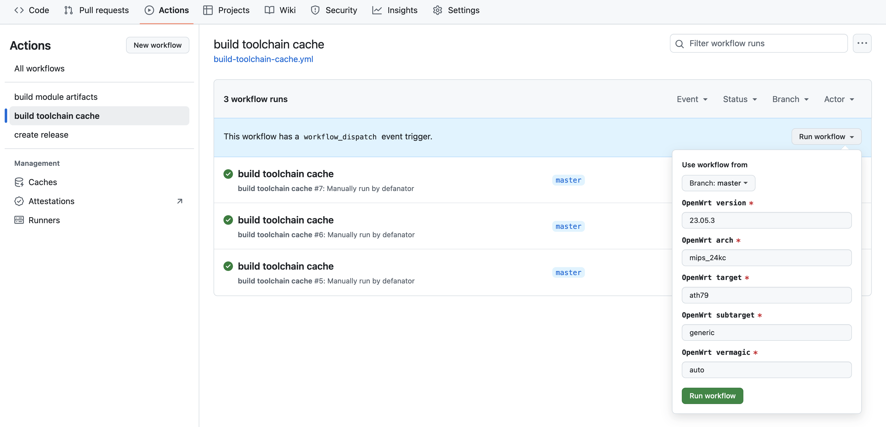
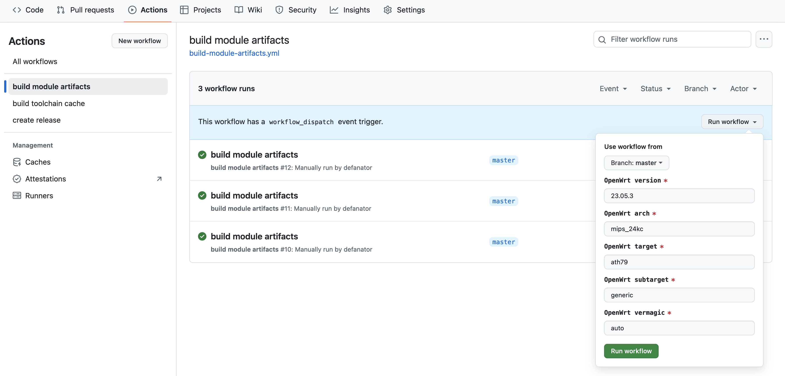
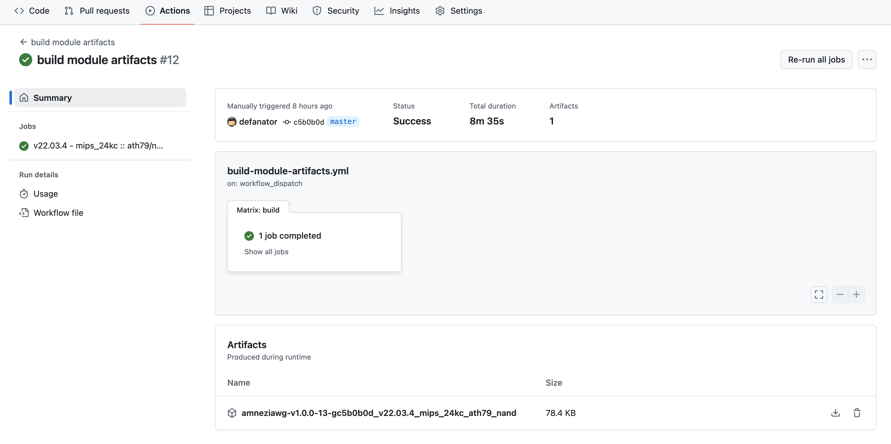

# amneziawg-openwrt

This repo is a fork of original [amneziawg-openwrt](https://github.com/amnezia-vpn/amneziawg-openwrt) one with a few extra things intended to help with creating reproducible builds of the AmneziaWG package artifacts for different versions and architectures supported by OpenWrt.

The idea is to keep it up to date with the upstream for all the general sources. All the extra features are basically combined into a top-level [Makefile](Makefile) and a set of GitHub action [workflows](.github/workflows/).

## Added features

 1. [Makefile](Makefile) providing a number of targets:
    ```
    % make

    Targets:
      help                    Show help message (list targets)
      show-env                Show environment details
      export-env              Export environment
      github-build-cache      Run GitHub workflow to create OpenWrt toolchain and kernel cache (use WORKFLOW_REF to specify branch/tag)
      github-build-artifacts  Run GitHub workflow to build amneziawg OpenWrt packages (use WORKFLOW_REF to specify branch/tag)
      build-toolchain         Build OpenWrt toolchain
      build-kernel            Build OpenWrt kernel
      build-amneziawg         Build amneziawg-openwrt kernel module and packages
      prepare-artifacts       Save amneziawg-openwrt artifacts from regular builds
      check-release           Verify that everything is in place for tagged release
      prepare-release         Save amneziawg-openwrt artifacts from tagged release
    ```
    It is heavily used by GitHub actions (see below), but it also can be used directly on host platforms to prepare an environment for building OpenWrt packages, including kernel modules.

 2. GitHub action workflows, in particular:
       - [build-toolchain-cache](.github/workflows/build-toolchain-cache.yml) - configures, compiles, and saves all the necessary OpenWrt tools required for building supplementary packages to GitHub cache;
       - [build-module-artifacts](.github/workflows/build-module-artifacts.yml) - builds AmneziaWG packages (.ipk) with the help of a tools created and saved in the GitHub cache by [build-toolchain-cache](.github/workflows/build-toolchain-cache.yml);
       - [create-release](.github/workflows/create-release.yml) - publishes GitHub release from a given tag.

## Creating OpenWrt toolchain and kernel cache

Note that this process could take about 2 hours on a [default GitHub hosted runner](https://docs.github.com/en/actions/using-github-hosted-runners/using-github-hosted-runners/about-github-hosted-runners#standard-github-hosted-runners-for-public-repositories). For using GitHub actions powered methods, you will need to create your own fork of this repository first.

### With GitHub actions from UI

Go to the Actions menu, select "build toolchain cache" workflow on the left, click on the "Run workflow" drop-down on the right. Enter all the details for target OpenWrt release and architecture, and press "Run workflow" button to initiate the job:



### With GitHub actions from CLI

Use the `github-build-cache` target (do not forget to set your own build details through `OPENWRT_*` environment variables):
```
% OPENWRT_RELEASE=23.05.4 OPENWRT_ARCH=mips_24kc OPENWRT_TARGET=ath79 OPENWRT_SUBTARGET=generic make github-build-cache
```

### Verifying created caches

Go to the Actions menu and select Management - Caches on the left:


Refer to the workflow logs to figure out what went wrong in case if a desired cache has not been created during the run.

### Manually on a host VM/instance

Run this:
```
% mkdir -p ${HOME}/openwrt-playground
% cd ${HOME}/openwrt-playground
% git clone https://github.com/defanator/amneziawg-openwrt.git
% cd amneziawg-openwrt
% OPENWRT_RELEASE=23.05.4 OPENWRT_ARCH=mips_24kc OPENWRT_TARGET=ath79 OPENWRT_SUBTARGET=generic make build-toolchain build-kernel
```

Do not forget to set your own build details. Once make invocation is complete, toolchain and kernel should be available in `${HOME}/openwrt-playground/openwrt`.

## Building AmneziaWG packages

Note that toolchain cache must exist in order for these steps to complete (in case if GitHub actions are used). Building AmneziaWG packages should not take longer than 10 minutes if corresponding toolchain/kernel cache is available.

### With GitHub actions from UI

Go to the Actions menu, select "build module artifacts" workflow on the left, click on the "Run workflow" drop-down on the right. Enter all the details for target OpenWrt release and architecture, and press "Run workflow" button to initiate the job:



### With GitHub actions from CLI

Use the `github-build-artifacts` target (do not forget to set your own build details through `OPENWRT_*` environment variables):
```
% OPENWRT_RELEASE=23.05.4 OPENWRT_ARCH=mips_24kc OPENWRT_TARGET=ath79 OPENWRT_SUBTARGET=generic make github-build-artifacts
```

### Locating the artifacts

Go to the workflow summary page and look for "Artifacts produced during runtime" section in the bottom:



### Manually on a host VM/instance

Make sure you completed toolchain and kernel builds as described above, then run this:
```
% cd ${HOME}/openwrt-playground/amneziawg-openwrt
% OPENWRT_RELEASE=23.05.4 OPENWRT_ARCH=mips_24kc OPENWRT_TARGET=ath79 OPENWRT_SUBTARGET=generic make build-amneziawg prepare-artifacts
```

Do not forget to set your own build details. Once make invocation is complete, packages should be available in `${HOME}/openwrt-playground/awgrelease`.

## Creating tagged releases

TBA

## Creating opkg feed

TBA

## Miscellaneous

This tooling uses automated way of obtaining vermagic of a given kernel based on required build parameters (`OPENWRT_RELEASE`, `OPENWRT_ARCH`, `OPENWRT_TARGET`, `OPENWRT_SUBTARGET`); `make show-env` could be quite handy while debugging various related stuff:

```
% make show-env | grep -- "^OPENWRT"
OPENWRT_RELEASE       23.05.3
OPENWRT_ARCH          mips_24kc
OPENWRT_TARGET        ath79
OPENWRT_SUBTARGET     generic
OPENWRT_VERMAGIC      34a8cffa541c94af8232fe9af7a1f5ba
OPENWRT_BASE_URL      https://downloads.openwrt.org/releases/23.05.3/targets/ath79/generic
OPENWRT_MANIFEST      https://downloads.openwrt.org/releases/23.05.3/targets/ath79/generic/openwrt-23.05.3-ath79-generic.manifest

% OPENWRT_RELEASE=22.03.4 OPENWRT_SUBTARGET=nand make show-env | grep -- "^OPENWRT"
OPENWRT_RELEASE       22.03.4
OPENWRT_ARCH          mips_24kc
OPENWRT_TARGET        ath79
OPENWRT_SUBTARGET     nand
OPENWRT_VERMAGIC      5c9be91b90bda5403fe3a7c4e8ddb26f
OPENWRT_BASE_URL      https://downloads.openwrt.org/releases/22.03.4/targets/ath79/nand
OPENWRT_MANIFEST      https://downloads.openwrt.org/releases/22.03.4/targets/ath79/nand/openwrt-22.03.4-ath79-nand.manifest
```

Output of `make show-env` should be present in GitHub action workflow logs as well.
